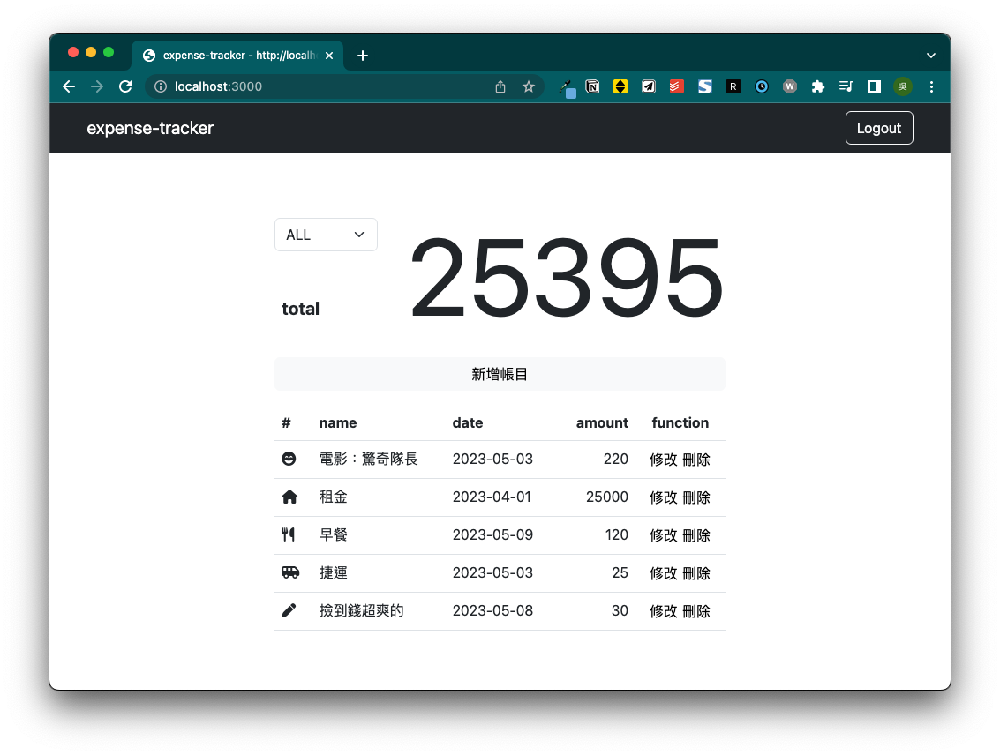

# Expense Tracker



## 簡介

一個記帳小專案，使用者登入後可以在頁面中進行帳目的新增、瀏覽、篩選、修改、刪除。

## 功能

- 查看所有帳目
- 新增帳目
- 篩選特定類別帳目
- 編輯帳目
- 刪除帳目
- 註冊帳號

## 開發環境與套件

### 主環境：
* VS Code - 編程環境
* node.js / express.js@4.18.2- 後端框架
* MongoDB - 資料庫
* mongoose@5.9.7 - MongoDB ODM

### 外觀：
* express-handlebars@4.0.2 - 樣板引擎
* handlebars-helpers@0.10.0 - 樣版引擎條件外掛
* bootstrap@5.3.0 - 樣式
* fontawesome@6.0.0 - icon

### 登入功能：
* bcryptjs@2.4.3 - 密碼雜湊外掛
* passport@0.4.1 - 登入功能外掛
* passport-local@1.0.0" - 本地登入功能外掛
* connect-flash@0.1.1 - session 驗證資料暫存外掛
* express-session@1.17.1 - session 驗證外掛

### 其餘 Middleware：
* body-parser@1.20.2 - 解析資料外掛
* method-override@3.0.0 - 能以 http 動詞重構路由的外掛

## 安裝與執行

1.確認已安裝 node.js 、 npm

  - node.js 可透過nvm進行安裝,而 npm 會在安裝 node.js 自動下載。
  - nvm 安裝方式[傳送門](https://github.com/creationix/nvm)
  - node.js 安裝方式:
  ```bash
  $ nvm install 14.16.0
  ```

2.開啟Terminal, 將此專案 Clone 到本地

  ```bash
  $ git clone https://github.com/rr37/expense-tracker.git
  ```

3.進入此專案資料夾

  ```bash
  $ cd expense-tracker
  ```

4.安裝 npm 套件

  ```bash
  $ npm install
  ```

5.參考 `.env.example`檔案，重構 `.env` 環境

6.安裝種子資料

  ```bash
  $ npm run seed
  ```

7.安裝完畢接續輸入

  ```bash
  $ npm run start
  ```

8.當Terminal顯示以下訊息，代表伺服器已成功運行

  ```
  App is running on http://localhost:3000
  ```

9.使用種子資料裡的測試帳號進行測試

``` bash
# 測試帳號一
email: user1@example.com
password: 12345678

# 測試帳號二
email: user2@example.com
password: 12345678
```


9.若欲暫停使用

  ```
  ctrl + c
  ```

10.打開瀏覽器至以下網址操作看看吧

  ```
  http://localhost:3000
  ```

## 作者

* **rr37** 
